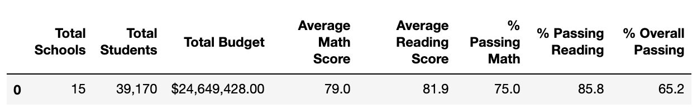
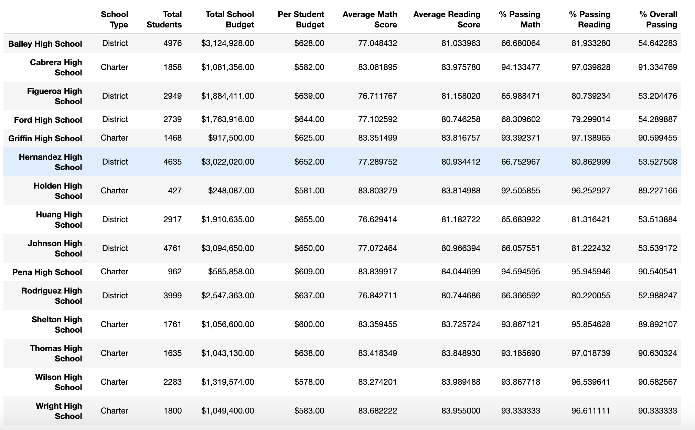
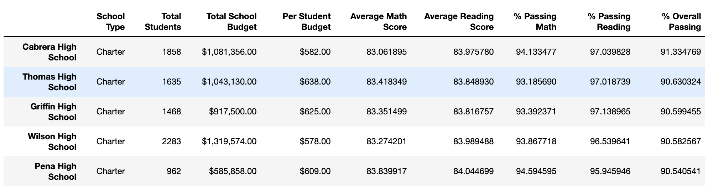
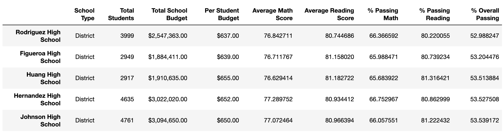
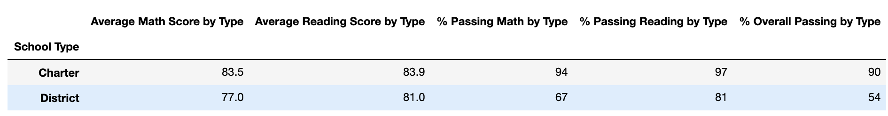
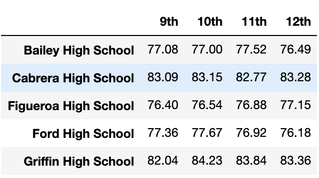
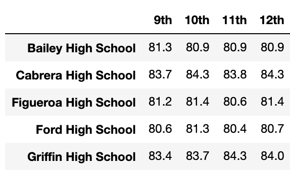
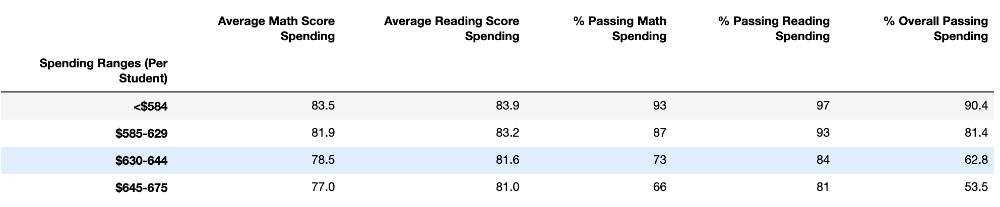
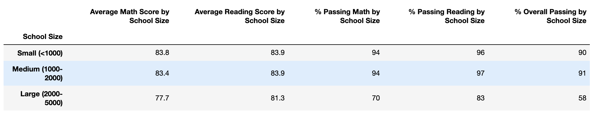

# School_District_Analysis

## Project Overview
Analyzing school district data with python to provide clear results and new findings. Analysis was conducted twice due to potential academic dishonesty among some students from one school. 

## Resources
Resources:
  - Found in the Resources folder
Software: 
  - Python 3.7
  - Anaconda
  - Jupyter Notebook

## Results
* Two changes in the district summary was that the average math score dropped 0.1 and the overall passing percentage of students passing dropped 1%.
  *
* The school summary stayed relatively the same, except for changes to the Thomas High School row, as I had to alter that data. 
  * 
* Replacing the ninth graders' math and reading scores made Thomas High School move out from being one of the top five performing schools. Thomas High School is not one of the top or bottom five schools, so it is somewhere in the middle. 
  * 
  * 
* By type, grade, spending, size
  * Type: This change in data affected the passing percentages in the comparison between charter and district schools. After the second analysis, there was a reduction in charter school passing percentages. 
  
  * Grade: The math and reading scores by grade did not change with the data replacement. 
  
  
  * Spending: The data replacement did not change the spending ranges for average math and reading scores, but it did lead to decreases in the spending randges for the % passing math, % passing reading, and % overall passing. 
  
  * Size: Removing the ninth grade scores affected the passing percentages for medium-sized schools (1,000-2,000 students). There was about a 6% drop in each percentage. The medium sized schools moved from top to second in performance. 
      

## Summary
There was evidence of academic dishonesty, specifically the reading and math grades for Thomas High School ninth graders appear to have been altered. We did not know the full extent of the academic dishonestly, but in order to uphold the state-testing standards, I replaced the math and reading scores for Thomas High School with NaNs, while keeping the rest of the data intact. After replacing the scores, I then repeated the school district analysis. 

Four changes in the updated school district analysis:
1. The district's average math and reading scores decreased
2. The district's overall passing percentage for students decreased
3. Thomas High school moved from being one of the top five performing schools within the district
4. Thomas High School's overall passing percentage significantly decreased
